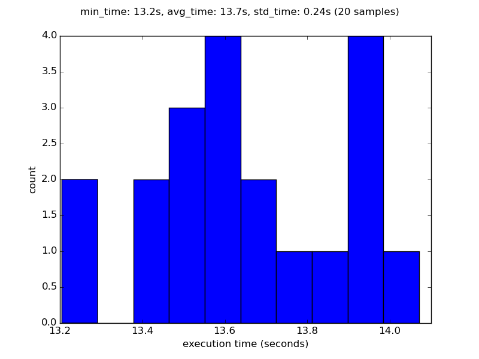

# Convolução - Grupo 3

## O que faz? Para que serve?

O programa de benchmark processa convoluções em images tridimensionais, o que é uma operação fundamental em processamento de imagens.  
Com ele podem-se realizar transformações geométricas, radiométricas, etc.
No benchmark em questão, a operação de convolução utilizada é a Transformada de Fourier.


## Por que é bom para medir desempenho?

A convolução de imagens é bastante intensiva em processamento e uso de memória, e por ser uma operação extremamente importante para diversas áreas (engenharia, medicina diagnóstica etc), é fundamental avaliar se uma máquina é apropriada para este tipo de uso.


## O que baixar

https://github.com/yugo4k/2016s1.mc723a.projeto1.parte1/convolutions.py

## Como compilar/instalar
O programa roda em `python` (é possível rodá-lo em 2.7 e 3.x) e exige os módulos `numpy` e `multiprocessing`. O ideal é que esses recursos não sejam baixados de repositórios compilados (e.g. _apt-get install_), mas sim sejam compilados através do `pip3` para obter a melhor performance na arquitetura da máquina utilizada.  
Eles não exigem instalação com permissões de administrador, podendo ser instalados no `home` do usuário.

## Como executar
Basta dar permissão de execução ao arquivo `convolutions.py` e executá-lo; pode-se alterar o número de voxels do cubo, o número de threads utilizadas e o número de convoluções executadas por thread, mas esses parâmetros foram _hardcoded_ para que o desempenho seja igualmente avaliado em todas execuções do programa.  
Ele fornece como output uma sequência na forma:  
```
(ID_THREAD, ID_CONV) VAR_TYPE (N_LAYERS, N_ROWS, N_COLS)  
write: #MB/s  
read: #MB/s  
```  
que se refere, respectivamente, aos identificadores de thread e convolução, o tipo de variável armazenada, as 3 dimensões do cubo e as velocidades de escrita e leitura.  
Os dois últimos valores são estatisticamente avaliados no final do output.

## Como medir o desempenho
As três primeiras medidas de desempenho é usam o _wall time_ (e.g. com o comando `time` do bash ou o programa de sistemas _unix-like_). A razão para utilizá-la é para sabermos quanto tempo real o programa usou em sua execução. Foram feitas 20 execuções, delas extraídas o tempo mínimo (estimativa de máxima performance), o tempo médio (estimativa de tempo usual) e o desvio padrão (quanto a máquina oscilou entre diferentes execuções do programa).

De maneira similar, é mensurável o tempo de escrita e leitura em disco dos resultados das convoluções, para medir o desempenho de _storage_ da máquina usada.

Além disso é possível aumentar ou diminuir o número de threads em execução, para medir o desempenho de _multithreading_.


## Como apresentar o desempenho

```
1- melhor tempo: #s  
2- tempo médio: (# ± #)s  
3- melhor velocidade de escrita: #MB/s  
4- velocidade de escrita média: (# ± #)MB/s  
5- melhor velocidade de leitura: #MB/s  
6- velocidade de leitura média: (# ± #)MB/s  
```
Devem ser executadas 20 medidas para avaliar a média e o desvio padrão, e o desvio padrão de cada medida deve ser usado como margens de erro.

## Medições base (uma máquina)

Processador: AMD PhenonII, 4 cores, 3.2MHz  
Memória: 10GB, ddr3, 1.333 MHz
Armazenamento: hdd sata3, 7200rpm, 32MB buffer

```
1- melhor tempo: 13.2s  
2- tempo médio: (13.7 ± 0.2)s  
3- melhor velocidade de escrita: 852MB/s  
4- velocidade de escrita média: (550 ± 362)MB/s  
5- melhor velocidade de leitura: 798MB/s  
6- velocidade de leitura média: (749 ± 43)MB/s  
```

wall time:  

